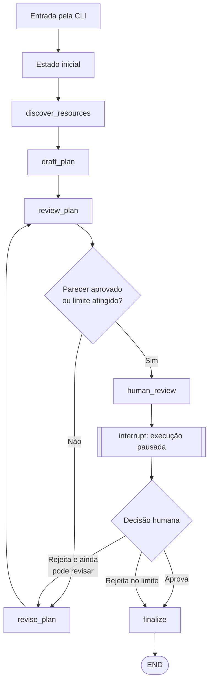
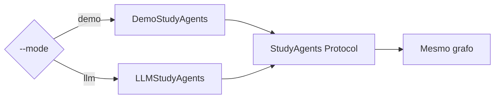
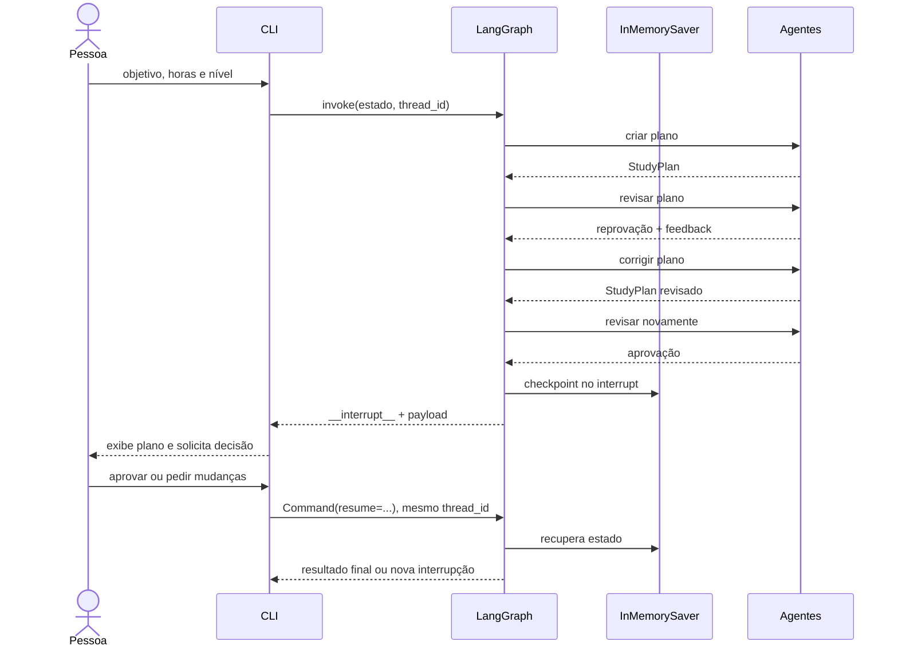

# Fluxo completo do Study Graph

Este documento acompanha uma execução do projeto desde o comando no terminal até
o encerramento do grafo. A intenção é mostrar não apenas **o que acontece**, mas
também **qual elemento da stack executa cada responsabilidade** e por que o fluxo
foi modelado dessa forma.

## Visão rápida

O sistema recebe um objetivo de aprendizado, encontra materiais, cria um plano,
submete esse plano a uma revisão independente e o corrige quando necessário. Só
depois disso o fluxo pausa e pede uma decisão humana. Uma aprovação finaliza o
documento; uma rejeição pode iniciar outra revisão, respeitando um limite.



## Elementos da stack

| Elemento | Papel neste projeto |
| --- | --- |
| Python | Implementação da aplicação e da CLI |
| LangChain | Interface de modelos, mensagens, structured output e definição da tool |
| LangGraph | Estado compartilhado, nós, arestas, ciclos, checkpoint e pausa/retomada |
| Pydantic | Contratos validados de plano e parecer |
| `TypedDict` | Contrato do estado compartilhado pelo grafo |
| `InMemorySaver` | Checkpointer usado durante o processo atual |
| pytest | Verificação determinística das rotas do workflow |
| uv | Ambiente, dependências e execução dos comandos |

LangChain cuida das capacidades relacionadas ao modelo. LangGraph cuida da
orquestração. Essa separação é importante: trocar o modelo não altera o desenho
do workflow, e alterar uma rota não exige reescrever os prompts.

## 1. A entrada começa na CLI

Uma execução típica começa assim:

```powershell
uv run study-graph `
  --goal "Aprender LangGraph construindo agentes" `
  --hours 6 `
  --level iniciante
```

O entry point `study-graph` está declarado em `pyproject.toml` e chama
`study_graph.cli:main`. A CLI:

1. carrega valores do ambiente e argumentos;
2. valida se há um objetivo e se a carga horária é positiva;
3. escolhe a implementação dos agentes;
4. compila o grafo;
5. cria um identificador para a execução;
6. envia o estado inicial ao LangGraph.

Existem dois modos:



- `demo` é determinístico, não usa rede e percorre uma revisão real do grafo;
- `llm` cria planejador e revisor com `init_chat_model` e um modelo configurado.

Os dois implementam o protocolo `StudyAgents`. O grafo conhece apenas esse
contrato, não a implementação concreta. Isso é **injeção de dependência** em uma
forma pequena: comportamento externo entra no grafo sem ficar acoplado a ele.

## 2. O grafo e o checkpoint são preparados

`build_graph(agents)` registra seis nós e suas transições em um `StateGraph`.
Na compilação, o projeto fornece um `InMemorySaver`:

```python
return workflow.compile(checkpointer=checkpointer or InMemorySaver())
```

O checkpointer é necessário porque `human_review` pode interromper a execução.
Para relacionar cada checkpoint à execução correta, a CLI envia um `thread_id`:

```python
config = {"configurable": {"thread_id": str(uuid.uuid4())}}
```

Neste projeto, `thread_id` significa “identidade desta execução do workflow”. Ele
precisa ser reutilizado quando a pessoa responde à interrupção. Como o saver é em
memória, os checkpoints desaparecem quando o processo termina. Isso mantém o
laboratório simples; persistência entre processos exigiria outro checkpointer,
mas não mudaria os nós.

## 3. O estado inicial entra no grafo

A primeira chamada a `graph.invoke` entrega:

```python
{
    "goal": "Aprender LangGraph construindo agentes",
    "hours_per_week": 6,
    "level": "iniciante",
    "max_revisions": 2,
    "trace": [],
}
```

O estado segue o contrato `StudyState`. Os campos essenciais existem desde o
início; campos produzidos mais tarde são `NotRequired`.

### Por que o estado guarda dicionários para plano e parecer?

Os agentes trabalham com `StudyPlan` e `PlanReview`, que são objetos Pydantic. Ao
escrever no estado, esses objetos são serializados com `model_dump()`. Ao ler,
são reconstruídos com `model_validate()`.

Isso mantém duas propriedades úteis:

- a fronteira do agente possui validação forte;
- o estado permanece formado por dados simples, apropriados para checkpoint.

### O reducer do trace

Cada nó devolve somente um novo evento, por exemplo:

```python
{"trace": ["plan_reviewed"]}
```

O campo foi anotado com `append_trace`. Em vez de o novo valor sobrescrever a
lista anterior, o LangGraph aplica o reducer e concatena os eventos. Os outros
campos usam a regra padrão: o valor novo substitui o anterior.

```text
[]
  + [resources_discovered]
  + [plan_drafted]
  + [plan_reviewed]
  = [resources_discovered, plan_drafted, plan_reviewed]
```

## 4. `discover_resources`: execução de uma tool

O primeiro nó recebe o estado inicial e invoca `find_learning_resources`.

Essa função usa o decorator `@tool` do LangChain. O decorator fornece metadados
como nome, descrição e schema de entrada. Hoje o nó chama a tool diretamente, de
forma previsível:

```python
resources = find_learning_resources.invoke({"topics": [...]})
```

A busca ocorre em um catálogo local de documentação oficial. Não há banco
vetorial porque o conjunto é pequeno e estático. Uma solução de retrieval seria
complexidade sem ganho didático neste estágio.

O nó retorna dois campos:

```python
{
    "resources": ["LangChain Overview — ...", "LangGraph Overview — ..."],
    "trace": ["resources_discovered"],
}
```

Ele não altera o `state` recebido. No modelo do LangGraph, o retorno representa
um **update** que será combinado ao estado compartilhado.

## 5. `draft_plan`: o agente planejador

O segundo nó entrega ao planejador apenas os dados de que ele precisa:

- objetivo;
- nível;
- horas por semana;
- recursos encontrados.

Ele não recebe o `StudyState` completo. Essa decisão impede que o agente fique
acoplado à implementação do grafo.

### No modo `demo`

`DemoStudyAgents.create_plan` constrói quatro semanas usando regras Python. O
primeiro plano contém prática, mas suas evidências ainda não mencionam testes.
Essa ausência é intencional: ela cria um motivo objetivo para o revisor rejeitar
o plano e permite observar o ciclo do grafo sem depender da aleatoriedade de um
LLM.

### No modo `llm`

`LLMStudyAgents` inicializa o modelo desta forma:

```python
model = init_chat_model(model_name, temperature=0)
self._planner = model.with_structured_output(StudyPlan)
```

`init_chat_model` é a interface unificada do LangChain para provedores de chat.
`with_structured_output(StudyPlan)` pede uma resposta compatível com o schema
Pydantic. O resultado não é texto livre que o projeto tenta interpretar depois;
é um `StudyPlan` validado.

Ao concluir, o nó registra:

```python
{
    "plan": plan.model_dump(),
    "revision_count": 0,
    "trace": ["plan_drafted"],
}
```

## 6. `review_plan`: um segundo papel avalia o resultado

O revisor recebe o plano, o objetivo e a carga horária. Ele produz `PlanReview`:

```python
{
    "approved": False,
    "score": 7,
    "issues": ["As evidências não incluem uma forma objetiva de verificação."],
    "suggestions": ["Inclua testes e um registro curto das decisões..."],
}
```

Separar planejamento e revisão cria dois papéis com objetivos distintos:

- o planejador tenta propor uma solução;
- o revisor procura falhas segundo critérios explícitos.

No modo LLM, ambos usam o mesmo modelo por economia, mas possuem prompts e
structured outputs diferentes. Eles são agentes distintos no nível de papel e
responsabilidade, não necessariamente processos ou modelos diferentes.

## 7. `after_review`: a aresta condicional

Depois do parecer, o LangGraph executa `after_review`. Essa função não modifica o
estado; ela apenas escolhe a próxima rota:

```text
review.approved == true                      ──► human_review
revision_count >= max_revisions              ──► human_review
parecer reprovado e ainda há revisões         ──► revise_plan
```

O limite garante terminação. Sem `max_revisions`, planejador e revisor poderiam
discordar indefinidamente.

Na primeira execução do modo `demo`, o parecer é reprovado e o contador vale
zero. A rota escolhida é `revise_plan`.

## 8. `revise_plan`: fechamento do ciclo

O nó reúne:

- problemas apontados pelo revisor;
- sugestões do revisor;
- feedback humano, quando a revisão foi solicitada por uma pessoa;
- plano anterior.

Essas informações voltam ao planejador. O novo plano substitui o anterior e o
contador é incrementado:

```python
{
    "plan": revised_plan,
    "revision_count": 1,
    "human_feedback": "",
    "trace": ["plan_revised"],
}
```

Existe uma aresta fixa de `revise_plan` para `review_plan`. Portanto, nenhuma
revisão pula a avaliação independente.

No modo `demo`, a versão revisada passa a exigir código executável, testes e uma
nota de decisões. O revisor encontra a evidência verificável e aprova com nota 9.
A aresta condicional direciona o fluxo a `human_review`.

## 9. `human_review`: pausa e checkpoint

O nó monta um payload legível contendo:

- a pergunta de aprovação;
- o plano renderizado em Markdown;
- o parecer estruturado.

Em seguida chama:

```python
decision = interrupt({...})
```

Nesse ponto, o LangGraph:

1. salva o estado pelo checkpointer;
2. suspende a execução antes de `finalize`;
3. devolve o payload da interrupção ao chamador.

A CLI recebe um resultado com `__interrupt__`, exibe o plano e pergunta se a
pessoa aprova. A linha do tempo fica assim:



## 10. Retomada com `Command(resume=...)`

A resposta humana não inicia um novo grafo. A CLI envia um comando de retomada
com o mesmo `thread_id`:

```python
Command(resume={"approved": approved, "feedback": feedback})
```

O valor de `resume` passa a ser o retorno da chamada `interrupt()` dentro de
`human_review`. O nó então decide o destino usando `Command`:

### Se a pessoa aprovar

```python
Command(
    update={"human_approved": True, "trace": ["human_approved"]},
    goto="finalize",
)
```

O comando combina duas coisas: a atualização de estado e a escolha do próximo
nó.

### Se a pessoa rejeitar e ainda houver tentativas

O feedback é salvo em `human_feedback`, e `goto="revise_plan"`. O plano passa de
novo por planejamento e revisão antes de outra interrupção humana.

### Se a pessoa rejeitar no limite

O fluxo registra `revision_limit_reached` e segue para `finalize`. A rejeição não
abre um ciclo infinito.

## 11. `finalize` e `END`

O último nó transforma a decisão em estado final:

```text
human_approved = true   ──► status = approved
human_approved = false  ──► status = rejected
```

O plano estruturado é renderizado em Markdown por `render_plan`. A apresentação
fica fora dos agentes: eles produzem dados, e uma função determinística decide o
formato final.

O nó escreve `status`, `final_document` e o último evento do trace. Sua aresta
fixa aponta para `END`, encerrando a execução.

Em uma execução aprovada do modo `demo`, o trace completo é:

```text
resources_discovered
→ plan_drafted
→ plan_reviewed
→ plan_revised
→ plan_reviewed
→ human_approved
→ workflow_approved
```

## Mapa de evolução do estado

| Momento | Campos adicionados ou alterados |
| --- | --- |
| Entrada | `goal`, `hours_per_week`, `level`, `max_revisions`, `trace` |
| Recursos | `resources` |
| Primeiro plano | `plan`, `revision_count = 0` |
| Parecer | `review` |
| Correção | novo `plan`, `revision_count += 1` |
| Decisão humana | `human_approved` e, se necessário, `human_feedback` |
| Finalização | `status`, `final_document` |

O estado funciona como o contrato entre os nós. Nenhum nó precisa conhecer toda
a história de chamadas; ele lê os campos relevantes e devolve seu update.

## Por que não usar uma chain linear?

Uma chain seria suficiente para “entrada → modelo → saída”. Este projeto possui
necessidades que deixam de ser lineares:

- o parecer decide entre dois caminhos;
- uma correção retorna a uma etapa anterior;
- o processo pausa para uma pessoa e precisa ser retomado;
- o estado precisa sobreviver à pausa;
- o número de revisões precisa ser controlado.

Essas são propriedades de workflow. O LangGraph torna as transições visíveis em
vez de escondê-las em uma sequência de `if`, loops e variáveis locais na CLI.

## Como os testes comprovam o fluxo

Os testes usam `DemoStudyAgents`, portanto não acessam rede nem API:

| Teste | Comportamento comprovado |
| --- | --- |
| `test_graph_revises_plan_and_pauses_for_human_review` | reprovação, correção, nova revisão e `interrupt` |
| `test_graph_resumes_after_approval` | checkpoint, `resume`, finalização aprovada |
| `test_human_can_request_one_more_revision` | feedback humano, segundo ciclo e nova pausa |

Essa é a principal razão para manter o modo determinístico: testar a orquestração
sem confundir falhas do grafo com variação ou indisponibilidade de um modelo.

## Arquivos para ler nesta ordem

1. `src/study_graph/domain.py` — contratos que circulam no sistema;
2. `src/study_graph/graph.py` — workflow e decisões de rota;
3. `src/study_graph/agents.py` — planejador e revisor nos dois modos;
4. `src/study_graph/tools.py` — fronteira de acesso aos materiais;
5. `src/study_graph/cli.py` — entrada, interrupção e retomada;
6. `tests/test_graph.py` — exemplos executáveis das rotas.

